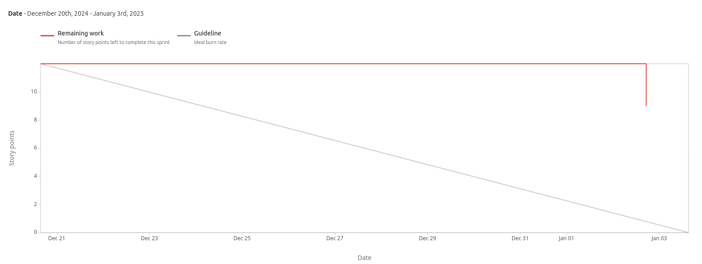

# Sprint 4

**From**: 2024-12-20

**To**: 2024-01-03

**Scrum Master**: Hugo Correia

**Product Owner**: André Oliveira

**Developers**: Joaquim Rosa, Miguel Belchior, Alexandre Cotorobai

## Sprint Goal

In order to complete this sprint, we need to implement the following tasks:

- Access Ticket Information - User
- Create Tickets - Admin
- Admin Login and Registration
- Terraform
- List Created Tickets - Admin
- CI/CD Pipelines
- End-to-End Containerization

| Expected     | Quantity |
| ------------ | -------- |
| Tasks        | 7        |
| Epics        | 2        |
| Story Points | 12       |

## Sprint Backlog

| Tasks (SCRUM-\*) | Description                      | Developer           | State       |
| ---------------- | -------------------------------- | ------------------- | ----------- |
| SCRUM-24         | Access Ticket Information - User | Hugo Correia        | TODO        |
| SCRUM-46         | Create Tickets - Admin           | Miguel Belchior     | In Progress |
| SCRUM-49         | Admin Login and Registration     | Alexandre Cotorobai | Done        |
| SCRUM-53         | Terraform                        | André Oliveira      | Done        |
| SCRUM-55         | List Created Tickets - Admin     | Hugo Correia        | In Progress |
| SCRUM-65         | CI/CD Pipelines                  | André Oliveira      | Done        |
| SCRUM-66         | End-to-End Containerization      | Alexandre Cotorobai | Done        |

### Task Status (Completed/Not Completed)

- [x] SCRUM-65: CI/CD Pipelines
- [x] SCRUM-66: End-to-End Containerization
- [x] SCRUM-53: Terraform
- [x] SCRUM-49: Admin Login and Registration
- [ ] SCRUM-46: Create Tickets - Admin
- [ ] SCRUM-55: List Created Tickets - Admin
- [ ] SCRUM-24: Access Ticket Information - User  

## User Stories

| User Stories | Description                  | Developer           | State       | Story Points |
| ------------ | ---------------------------- | ------------------- | ----------- | ------------ |
| SCRUM-24     | Access Ticket Information    | Hugo Correia        | TODO        | 3            |
| SCRUM-46     | Create Tickets - Admin       | Miguel Belchior     | In Progress | 3            |
| SCRUM-49     | Admin Login and Registration | Alexandre Cotorobai | Done        | 3            |
| SCRUM-55     | List Created Tickets - Admin | Hugo Correia        | In Progress | 3            |

Team Velocity: 3

## Sprint Review

| Concluded    | Quantity |
| ------------ | -------- |
| Tasks        | 4        |
| Epics        | 1        |
| Story Points | 3        |

## Sprint Retrospective

Although we are behind schedule, we implemented the terraform, which was one of the main objectives of this sprint. We also implemented the user story for admin login and registration, CI/CD pipelines, and end-to-end containerization. The user story for listing created tickets - admin is in progress, and the user story for creating tickets - admin is in progress.

## Sprint Burndown Chart

