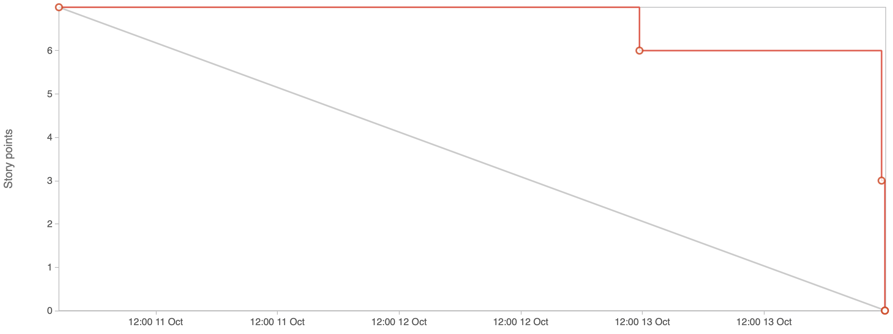

# Sprint 1

**From**: 2024-10-10

**To**: 2024-10-13

**Scrum Master**: Alexandre Cotorobai

**Product Owner**: Miguel Belchior

**Developers**: Hugo Correia, Joaquim Rosa, André Oliveira

## Sprint Goal

In order to complete the second milestone of our project, it is expectable to conclude the following sprints goals:

- Prepare First Presentation
- Prepare the Initial Presentation Website
- Setup Backlog
- Set the "Definition of Ready"
- Set the "Definition of Done"
- Architecture

| Expected     | Quantity |
| ------------ | -------- |
| Tasks        | 12       |
| Epics        | 1        |
| Story Points | 7        |

## Sprint Backlog

| Taks (SCRUM-\*) | Description                 | Developer     | State | 
| --------------- | --------------------------- | ------------- | ----- | 
| SCRUM-8         | Landing Page - Frontend            | Joaquim Rosa      | Done  |
| SCRUM-9         | Landing Page - Testing             | Miguel Belchior   | Done  |
| SCRUM-10        | AWS Cognito Setup                  | André Oliveira    | Done  |
| SCRUM-11        | AWS Cognito Setup                  | André Oliveira    | Done  |
| SCRUM-12        | API Authentication and Authorization | André Oliveira  | Done  |
| SCRUM-13        | Landing Page - PWA Support           | Joaquim Rosa    | Done  |
| SCRUM-14        | API Authentication and Authorization | All             | Done  |
| SCRUM-15        | Landing Page - Little Refacture      | Hugo Correia    | Done  |
| SCRUM-16        | Backend Testing                      | Miguel Belchior | Done  |
| SCRUM-17        | Link Back-end with Front-end         | Hugo Correia    | Done  |
| SCRUM-18        | User Login - Testing              | Joaquim Rosa       | Done  |
| SCRUM-19        | User Registration - Testing       | Joaquim Rosa       | Done  |

### Task Status (Completed/Not Completed)

- [x] SCRUM-8: Landing Page - Frontend
- [x] SCRUM-9: Landing Page - Testing
- [x] SCRUM-10: AWS Cognito Setup
- [x] SCRUM-11: AWS Cognito Setup
- [x] SCRUM-12: API Authentication and Authorization
- [x] SCRUM-13: Landing Page - PWA Support
- [x] SCRUM-14: API Authentication and Authorization
- [x] SCRUM-15: Landing Page - Little Refacture
- [x] SCRUM-16: Backend Testing
- [x] SCRUM-17: Link Back-end with Front-end
- [x] SCRUM-18: User Login - Testing
- [x] SCRUM-19: User Registration - Testing

## User Stories

| User Stories    | Description                 | Developer     | State | Story Points |
| --------------- | --------------------------- | ------------- | ----- | ------------ |
| SCRUM-5         | User Registration            | All          | Done  | 3    |
| SCRUM-6         | User Login                   | All          | Done  | 3    |
| SCRUM-7         | Landing Page                 | All          | Done  | 1    |

Team Velocity: 7

## Sprint Review

| Concluded    | Quantity |
| ------------ | -------- |
| Tasks        | 12       |
| Epics        | 0        |
| Story Points | 7        |

## Sprint Retrospective

Despite the short length of this first sprint, we didn’t expect to deliver a large number of features. However, we were able to complete all the tasks we had planned. These include three user stories related to the user authentication epic: user registration, login, and the landing page.

## Sprint Burndown Chart

