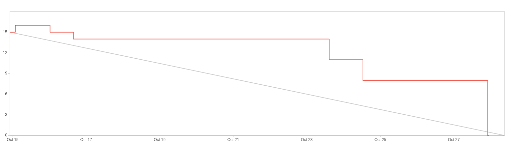

# Sprint 1

**From**: 2024-10-14

**To**: 2024-10-28

**Scrum Master**: Hugo Correia

**Product Owner**: André Oliveira

**Developers**: Joaquim Rosa, Miguel Belchior, André Oliveira

## Sprint Goal

In order to complete the second milestone of our project, it is expectable to conclude the following sprints goals:

- Implement the first version of the Matches Page
- Update the Landing Page with the next match
- Implement the Games API
- Populate the Games DB
- Link the Backend with the Frontend
- Implement the Games API - Testing
- Implement the Frontend Tests
- Implement the Ticket microservice API
- Implement the Purchase ticket Page v1
- Implement the Backend Testing
- Implement the User logout implementation
- Implement the User logout testing - Backend
- Implement the Integration with Frontend
- Implement the User logout testing - Frontend
- Implement the Frontend Checkout
- Implement the Backend Checkout
- Implement the Checkout success and cancelled pages
- Implement the Payment Checkout

| Expected     | Quantity |
| ------------ | -------- |
| Tasks        | 17       |
| Epics        | 2        |
| Story Points | 15        |

## Sprint Backlog

| Taks (SCRUM-\*) | Description                          | Developer       | State |
| --------------- | ------------------------------------ | --------------- | ----- |
| SCRUM-27         | First Version of Matches Page       | Hugo Correia   | Done  |
| SCRUM-28         | Update Landing Page With the Next Match | Hugo Correia | Done  |
| SCRUM-31        | Games API                    | Joaquim Rosa  | Done  |
| SCRUM-37        | Populate Games DB                    | Joaquim Rosa  | Done  |
| SCRUM-38        | Link Backend with Frontend | Hugo Correia  | Done  |
| SCRUM-40        | Games API - Testing           | Joaquim Rosa    | Done  |
| SCRUM-43        | Frontend Tests | Hugo Correia             | Done  |
| SCRUM-29        | Ticket microservice API     | Alexandre Cotorobai    | Done  |
| SCRUM-36        | Purchase ticket Page v1                      | Hugo Correia | Done  |
| SCRUM-39        | Backend Testing         | Alexandre Cotorobai    | Done  |
| SCRUM-32        | User logout implementation | Andre Oliveira    | Done  |
| SCRUM-33        | User logout testing - Backend         | Andre Oliveira    | Done  |
| SCRUM-34        | Integration with Frontend         | Andre Oliveira    | Done  |
| SCRUM-35        | User logout testing - Frontend         | Joaquim Rosa    | Done  |
| SCRUM-41       | Frontend Checkout     | Miguel Belchior    | Done  |
| SCRUM-42       | Backend Checkout     | Miguel Belchior    | Done  |
| SCRUM-44       | Checkout success and cancelled pages     | Andre Oliveira    | Done  |

### Task Status (Completed/Not Completed)

- [x] SCRUM-27: First Version of Matches Page
- [x] SCRUM-28: Update Landing Page With the Next Match
- [x] SCRUM-31: Games API
- [x] SCRUM-37: Populate Games DB
- [x] SCRUM-38: Link Backend with Frontend
- [x] SCRUM-40: Games API - Testing
- [x] SCRUM-43: Frontend Tests
- [x] SCRUM-29: Ticket microservice API
- [x] SCRUM-36: Purchase ticket Page v1
- [x] SCRUM-39: Backend Testing
- [x] SCRUM-32: User logout implementation
- [x] SCRUM-33: User logout testing - Backend
- [x] SCRUM-35: User logout testing - Frontend
- [x] SCRUM-41: Frontend Checkout
- [x] SCRUM-42: Backend Checkout
- [x] SCRUM-44: Checkout success and cancelled pages

## User Stories

| User Stories | Description       | Developer | State | Story Points |
| ------------ | ----------------- | --------- | ----- | ------------ |
| SCRUM-23      | List Available Matches | All       | Done  | 3            |
| SCRUM-21      | Buy Ticket        | All            | Done       | 3            |
| SCRUM-30      | User Logout      | All             | Done        | 1            |
| SCRUM-26      | Payment Checkout | All       | Done        | 8          |

Team Velocity: 15

## Sprint Review

| Concluded    | Quantity |
| ------------ | -------- |
| Tasks        | 17       |
| Epics        | 1        |
| Story Points | 15        |

## Sprint Retrospective

### What we did well

We managed to complete all the tasks we had planned for this sprint. We were able to work together and help each other when needed. We also managed to have a good communication between the team members. We were able to have a good understanding of the tasks and the work that needed to be done. 
Understanding Stripe API and implementing the payment checkout was a big achievement for the team.

## Sprint Burndown Chart

