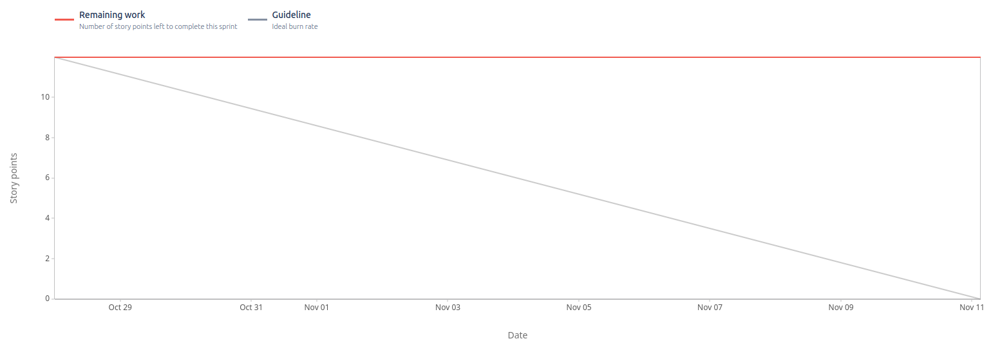

# Sprint 3

**From**: 2024-10-28

**To**: 2024-11-11

**Scrum Master**: Joaquim Rosa

**Product Owner**: Alexandre Cotorobai

**Developers**: Miguel Belchior, André Oliveira, Hugo Correia

## Sprint Goal

In order to complete the second milestone of our project, it is expectable to conclude the following sprints goals:

- Access Ticket Information
- Admin Login and Registration
- List Purchased Tickets - Admin
- Create Tickets - Admin
- Deploy the project using Terraform

| Expected     | Quantity |
| ------------ | -------- |
| Tasks        | 4        |
| Epics        | 2        |
| Story Points | 12       |

## Sprint Backlog

| Tasks (SCRUM-\*) | Description                    | Developer | State |
| ---------------- | ------------------------------ | --------- | ----- |
| SCRUM-24         | Access Ticket Information      | None      | TODO  |
| SCRUM-49         | Admin Login and Registration   | None      | TODO  |
| SCRUM-48         | List Purchased Tickets - Admin | None      | TODO  |
| SCRUM-46         | Create Tickets - Admin         | None      | TODO  |

### Task Status (Completed/Not Completed)

- [] SCRUM-24: Access Ticket Information
- [] SCRUM-49: Admin Login and Registration
- [] SCRUM-48: List Purchased Tickets - Admin
- [] SCRUM-46: Create Tickets - Admin

## User Stories

| User Stories | Description                    | Developer | State | Story Points |
| ------------ | ------------------------------ | --------- | ----- | ------------ |
| SCRUM-24     | Access Ticket Information      | None      | TODO  | 3            |
| SCRUM-49     | Admin Login and Registration   | None      | TODO  | 3            |
| SCRUM-48     | List Purchased Tickets - Admin | None      | TODO  | 3            |
| SCRUM-46     | Create Tickets - Admin         | None      | TODO  | 3            |

Team Velocity: 0

## Sprint Review

| Concluded    | Quantity |
| ------------ | -------- |
| Tasks        | 0        |
| Epics        | 0        |
| Story Points | 0        |

## Sprint Retrospective

In this sprint, we were unable to complete any of the tasks due to a lack of time to invest in the project. We were working on other projects, and none of the team members could dedicate much time to this project. We tried to do the terraform for deploying the project, but we were unable to complete it. We were also unable to do the daily stand-ups; instead, we organized two short weekly meetings to discuss each team member's progress.

## Sprint Burndown Chart

