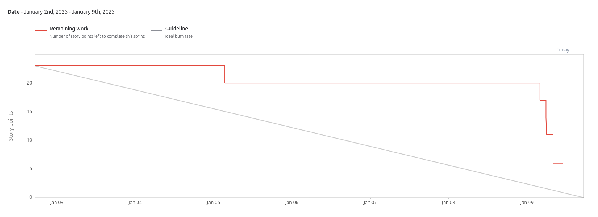

# Sprint 5

**From**: 2025-01-03

**To**: 2025-01-09

**Scrum Master**: Miguel Belchior

**Product Owner**: Alexandre Cotorobai

**Developers**: Joaquim Rosa, Hugo Correia, André Oliveira

## Sprint Goal

In order to complete this milestone of our project, it is expectable to conclude the following sprints goals:

- Buy Ticket - Persist in Ticket Service
- Access Ticket Information - User
- Create Tickets - Admin
- Edit Ticket - Admin
- List Purchased Tickets - Admin
- Validate Ticket
- List Created Tickets - Admin

| Expected     | Quantity |
| ------------ | -------- |
| Tasks        | 7        |
| Epics        | 2        |
| Story Points | 23       |

## Sprint Backlog

| Taks (SCRUM-\*) | Description                            | Developer       | State |
| --------------- | -------------------------------------- | --------------- | ----- |
| SCRUM-24        | Access Ticket Information - User       | Hugo Correia    | TODO  |
| SCRUM-46        | Create Tickets - Admin                 | Miguel Belchior | Done  |
| SCRUM-21        | Buy Ticket - Persist in Ticket Service | Miguel Belchior | Done  |
| SCRUM-47        | Edit Ticket - Admin                    | André Oliveira  | Done  |
| SCRUM-48        | List Purchased Tickets - Admin         | Unassigned      | TODO  |
| SCRUM-50        | Validate Ticket                        | André Oliveira  | Done  |
| SCRUM-55        | List Created Tickets - Admin           | Hugo Correia    | Done  |

### Task Status (Completed/Not Completed)

- [ ] SCRUM-24: Access Ticket Information - User
- [x] SCRUM-46: Create Tickets - Admin
- [x] SCRUM-21: Buy Ticket - Persist in Ticket Service
- [x] SCRUM-47: Edit Ticket - Admin
- [ ] SCRUM-48: List Purchased Tickets - Admin
- [x] SCRUM-50: Validate Ticket
- [x] SCRUM-55: List Created Tickets - Admin

## User Stories

| User Stories | Description                            | Developer  | State | Story Points |
| ------------ | -------------------------------------- | ---------- | ----- | ------------ |
| SCRUM-24     | Access Ticket Information - User       | All        | TODO  | 3            |
| SCRUM-46     | Create Tickets - Admin                 | All        | Done  | 3            |
| SCRUM-21     | Buy Ticket - Persist in Ticket Service | All        | Done  | 3            |
| SCRUM-47     | Edit Ticket - Admin                    | All        | Done  | 3            |
| SCRUM-48     | List Purchased Tickets - Admin         | Unassigned | TODO  | 3            |
| SCRUM-50     | Validate Ticket                        | All        | Done  | 5            |
| SCRUM-55     | List Created Tickets - Admin           | All        | Done  | 3            |

Team Velocity: 17

## Sprint Review

| Concluded    | Quantity |
| ------------ | -------- |
| Tasks        | 6        |
| Epics        | 2        |
| Story Points | 17       |

## Sprint Retrospective

### What we did well

In this sprint, we managed to complete all the logic related to the ticket service, that was the main goal of this sprint. With this, we concluded the goals for our project after the redeffinition of the project scope.

## Sprint Burndown Chart

