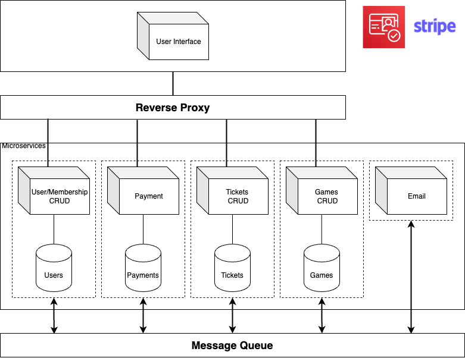
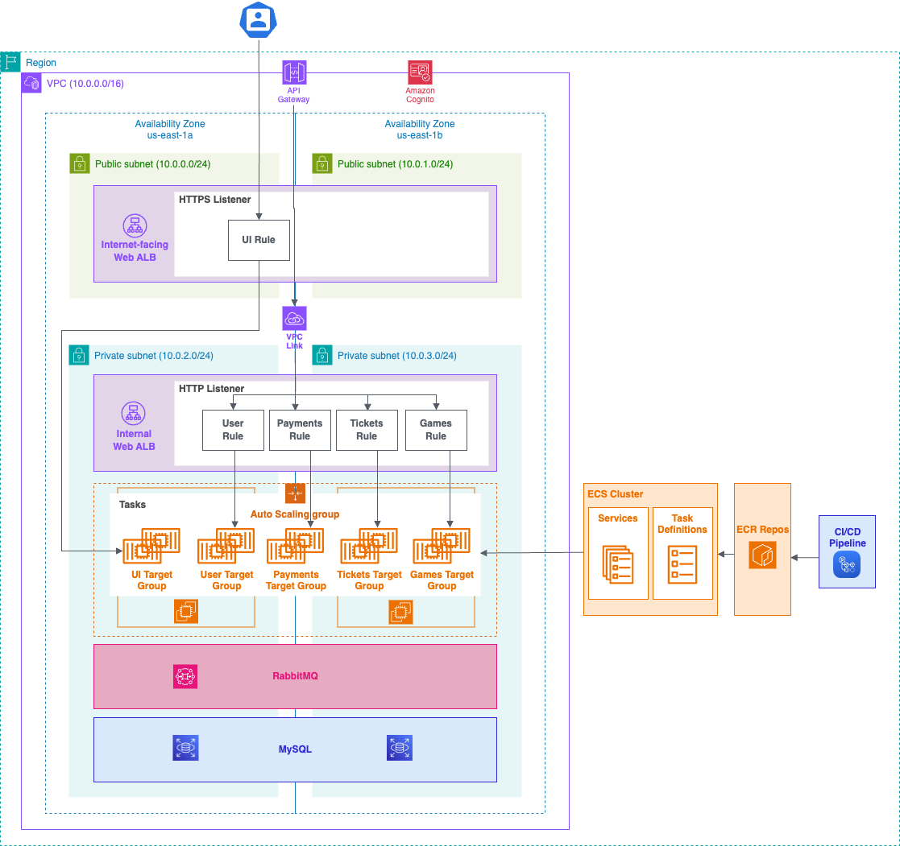

# Architecture

## Description

### User Interface

This microservice handles the front-end user interface of the platform. It is responsible for rendering the web pages and ensuring that users can interact with the platform’s features. This includes displaying data, managing forms, and providing an intuitive experience for both members and administrators.

### User/membership management API

This microservice is responsible for managing the users of the platform, including members of a club or organization. It handles user registration, authentication, user roles, and membership tiers (if applicable).

### Payment management API

This microservice manages the processing of payments using an external service. It integrates with payment gateways or providers to handle transactions, subscriptions, and renewals.

### Tickets management API

This microservice is responsible for managing the creation, sale, and distribution of tickets for games. It handles ticket booking, issuance, and validation.

### Games management API

This microservice manages the games available on the platform. It includes features such as game creation, scheduling, and results tracking. It also provides information about upcoming games, past games, and pavilions.

### Emails management API

This microservice handles the sending of emails for various purposes, such as notifications, confirmations, and updates. It integrates with email delivery services to ensure that the platform can communicate with its users effectively.

### Identity Provider

This microservice provides authentication and user identity management using AWS Cognito. It ensures secure access to the platform by handling user login, token generation, and session management.

## Microservices Architecture

## Cloud Architecture

