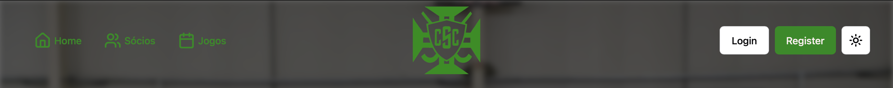
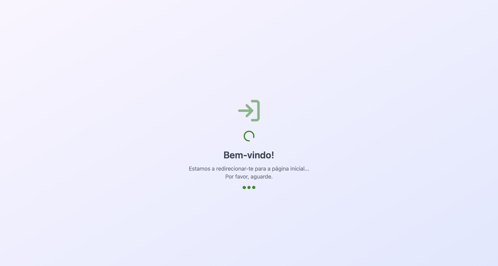

### Login and Register Buttons

Buttons are provided to navigate to the Cognito hosted UI for user login and registration.

```html
<div>
    <Link to={import.meta.env.VITE_LOGIN_SIGN_UP}>
      <Button variant="outline" className="mr-2">Login</Button>
    </Link>
    <Link to={import.meta.env.VITE_LOGIN_SIGN_UP}>
      <Button className="mr-2">Register</Button>
    </Link>
</div>
```



### Redirect Page

This component handles the redirection after a successful login or registration. It extracts the authorization code from the URL and initiates the login process.

#### Functions

- **`getCodeFromUrl()`**

  - Extracts the authorization code from the URL query parameters.

- **`login(code: string)`**
  - Calls the backend login function with the obtained code.



#### `useEffect` Hook

- Extracts the authorization code from the URL and calls the `login` function if a code is present.
- **Example:**

```plaintext
http://localhost:8080/oauth2/idpresponse?code=1cc8b639-ddfb-4501-a819-2dcd8e13b849
```
