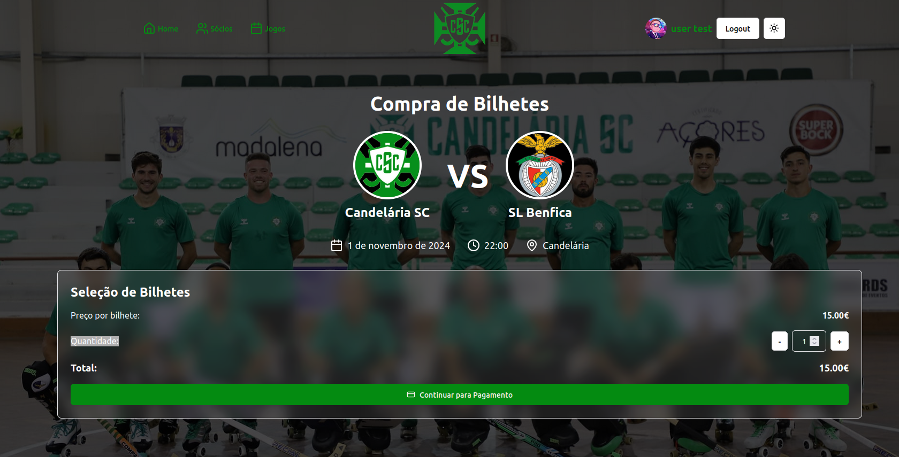

### Buy Ticket

After choosing the desired game, the user can select the number of tickets for that game and proceed by clicking the "Continuar para pagamento" button.



After clicking the button, the user is redirected to the payment page, where they can choose the payment method and complete the purchase. This was implemented using the Stripe API.

### Functions

1. **`createCheckoutSession`**:
   - Responsible for creating a checkout session using the Stripe API. It sends a request to the `PaymentsService.create_checkout_session` method with a predefined price ID and quantity.
   
     ```javascript
     const createCheckoutSession = async () => {
       const checkout_session = (await PaymentsService.create_checkout_session(
           "price_1QBvVfJo4ha2Zj4nO3F0YLFr", 1
       )).data;
       return checkout_session;
     };
     ```


2. **`checkoutSessionMutation`**:
   - It uses the `useMutation` hook from `@tanstack/react-query` to handle the mutation (i.e., the creation of the checkout session) and manage its state (loading, success, error).
     ```javascript
     const checkoutSessionMutation = useMutation({
       mutationFn: createCheckoutSession,
       onSuccess: (data) => {
         window.location.href = data.checkout_url
       },
       onError: (error) => {
         console.error("Redirect falhou", error.message);
       }
     });
     ```